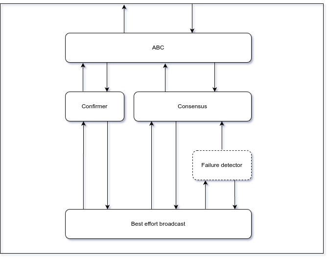

# Accountable Byzantine Consensus
Project for Dependable Distributed Systems course

[Repository](https://github.com/Hackfront-ITA/dds-project)

### Project description
The goal of the project is to implement an accountable consensus primitive based on this [paper](https://doi.org/10.1016/j.jpdc.2023.104743) ([archived](./docs/paper.pdf)).
There are no constraints on the programming language or libraries to be used, nor on the environment (local machine, docker, cloud free tiers, simulator).
Part of the project is to perform a dependability evaluation (both from a functionality and performance point of view).
Crash failures must be considered, whereas some Byzantine misbehaviours could be
considered in the evaluation.

[Full details](./docs/request.pdf)

### People
- Alessandro Cecchetto -- 1941039
- Emanuele Roccia -- 1967318

## Contents
- [Setup](#setup)
- [Technologies](#technologies)
- [Implementation](#implementation)
- [Experiments](#experiments)
- [Dependability evaluation](#dependability-evaluation)

### Setup

Customize [.env](./.env) file according to your preferences:

```shell
DDS_LOG_LEVEL="INFO"  ## Log level (DEBUG, INFO, WARNING, ERROR, CRITICAL)

DDS_NETWORK="172.21.0.0/16"   ## Subnet used by virtual network
DDS_PORT="4678"       ## Port used by broadcast module

DDS_NUM_CORRECT="5"   ## Number of correct processes
DDS_NUM_BYZ="3"       ## Number of byzantine processes
DDS_T0_AC="3"         ## Max number of failures in confirmer according to paper
```

To bring up the whole infrastructure a single command is necessary:

```shell
cd dds-project
docker compose up
```

### Technologies

This project uses Docker to create a virtual environment, containing both correct processes and byzantine processes, that communicate together via a virtual network.

Everything needed to setup the infrastructure is described in [docker-compose.yml](./docker-compose.yml) file, for an easy [setup](#setup).

For the code part, we used Python as it is a powerful language.

The paper also requires a threshold signature scheme (TSS). For this purpose we chose BLS algorithm, since it has robust Python bindings, available on PIP in the [blspy](https://pypi.org/project/blspy) package.

### Implementation

A (correct) process is composed of four components, that communicate together via an event-based interface.

- Confirmer
- Consensus
- Failure detector (required by flooding consensus)
- Best effort broadcast



#### Event-based interface

Every component is a derived class from an [ObjectWithEvents](https://stackoverflow.com/a/6158658) class, from which it inherits the `on()` and `trigger()` methods.
The purpose is to make the code as similar as possible to the pseudo-code provided by the study material and the ABC paper.

An example of the API provided by the ObjectWithEvents class:
```python
def on_decision(_, decision):
	logger.info(f'Consensus decided {decision}')

consensus.on('decide', on_decision)

consensus.trigger('propose', value)
```

#### Best effort broadcast

Virtually every component that we use needs an underlying best effort broadcast primitive.
We implemented BeB on top of UDP. Simply when it receives a `send` event it broadcast an UDP packet to the broadcast address of the subnet, so it reaches every host in it.
Every node listens to the broadcast address and a fixed port defined in [.env](./.env) file. When a packet arrives, a `receive` event is triggered, to signal all the listening components.

Events coming from and to the BeB component carry also some parameters, which are serialized/de-serialized using JSON to build the packet payload.

Also, since different components use the same BeB component, to differentiate between its users, a "class id" is added to the packet as an header.

There is an issue: packet size, so its payload, is limited by the MTU of the network interface, which typically is 1500 bytes. Since we use a virtual interface, we can increase a bit the MTU and don't care about this limitation for our experiments.

#### Key exchange

The TSS scheme that we use requires that every process has its own private key (to sign messages) and the public key of every other process (to verify signatures).

To quickly allow all the processes to have this information, not taking into account privacy issues, each process in [config.py](./src/config.py):

- Generates the list of running processes, identified by their IPv4 address
- Uses them as a seed to generate every process private key
- For each of them derives the public key and stores them in an dictionary indexed by process address

For all processes, except the current process, the private key is discarded. In this way every process has the same set of public key, but the corresponding private key for only itself.

#### Light certificate message
One difference between the paper and our implementation is the content of the light certificate message.

While in the paper the light certificate consists only of the combined signature, in the TSS scheme that we use this is not enough for validation.

In addition, an ordered list of public keys of the participating processes is required. To address this, we included the instance *from* array within the light certificate message, that contain the process list in the necessary order.

The process then builds the PK array by mapping every process with their public key.

#### Certificate conflict checking
To check conflicts between light certificates, a dictionary is used to store for each process the set of values that it has confirmed.

As a new light certificate arrives, the validity of certificate is checked, otherwise discarded.
Then, for each process contained in it, we add to its set in the dictionary the value associated to the certificate.
If there is a set in the dictionary that has more than one value, it is for sure a byzantine process, so the the full certificate is sent and the confirmer algorithm continues.

We removed the array of obtained light certificates that was included in the paper because it was no longer useful.

An analogous technique is used for the full certificates, but instead of using sets of values we use sets of messages, but the check is basically the same.

### Experiments

We made some experiments with the confirmer module, in particular we tried to interfere with the confirmation using byzantine processes.

#### Crash faults

Without byzantines, only the value submitted by at least $n - t_0$ processes is confirmed by them, out of the multiple values submitted. Other values are not confirmed because they are submitted by no more than $t_0$ processes. A process does not submit more than one value, so there are at most $n$ submit messages.

We tested the behavior of the confirmer in the presence of crash faults, by starting only some of the correct processes (Out of 7 processes, first with 5 and then with 3).
All of them propose a single value, 1234.

As expected, the processes succeed in confirming the value only if the number of faulty (crashed) processes does not exceed $t_0 = 2$, so only in the first case (5 working processes).

#### Byzantine behavior

Our byzantine nodes are initially considered as correct processes, with each having a private key and every other process having their corresponding public keys, exactly like correct processes do.

Their behavior is to echo all submit messages that other processes send, but replacing the signatures of the value with their own.

With byzantines, more than one value can be confirmed, as there is no guarantee that only a single value has $n - t_0$ submit messages. The confirmer however should detect this behaviour.

To test this, we created a network of 7 nodes: 4 correct processes and 3 byzantines. Half of the correct processes propose a value (1234) while the other half proposes another value (9876). We considered $t_0 = ceil(\frac{n}{3}) - 1 = 2$.

To confirm a value, a correct process needs $n - t_0 = 5$ submit messages, so in this test run every correct process succeeds in confirming its proposed value, thanks to the byzantines that broadcast a submit message both for 1234 and 9876. In fact, the confirmer detects the three byzantine processes succesfully, with proof of culpability which is the set of conflicting submit messages.

### Dependability evaluation

#### Performance

According to the referenced paper, the implementation of the Confirmer mechanism for Byzantine detection inevitably introduces a message delay that slows down the performances. This delay arises from the exchange of messages associated with light certificates, the submission round, and full certificates.

In the context of our implementation, we can distinguish between two different scenarios:

##### Best case

The best-case scenario occurs when there are no conflicting pairs of light certificates, thereby eliminating the need for the exchange of full certificates. In this scenario, $t_0$ faulty processes are considered, resulting in the following message exchange:

Submit round + light certificate round, sent by n - t0 processes $= 2 \cdot (n - t_{0})$ messages

##### Worst case

The worst-case scenario occurs when conflicting pairs of light certificates are detected due to the presence of Byzantine processes that send two different values without experiencing crash failures. This situation necessitates the broadcast of full certificates, resulting in the following overhead:

Submit round + light certificate round + full certificate round, sent by n processes $= 3 \cdot n$ messages $= 3 \cdot n \cdot n$ packets

#### Availability

With respect to the availability evaluation, we consider the set of processes in the system in the following arrangement:


The whole system is available only if the number of faulty processes does not exceed $t_0$.
This is justified by the fact that the confirmer triggers the confirmation when it receives $n - t_0$ submissions related the local value, so it needs at least that number of process. The flooding consensus that we used does not have a requirement on minimum number of processes.

We can imagine the system with a *core* of $n - t_0$ processes that are in series, and other $t_0$ processes in parallel to the core that *support* it.
As the faults occur, the *support* processes go down. If the number of faults exceed $t_0$, the processes in the *core* go down, so the entire series.

This is only a virtual arrangement: processes do not strictly belong to a set or the other.

We define $A_t$ as the availability of the entire system, while $A = A_c = A_s$ as the availability of a single process.

Availability of nodes in parallel: $A_{parallel} = 1 - [ \prod{(1 - A_i)} ]$

Availability of nodes in series: $A_{series} = \prod{A_i}$

Availability of the system:

$$ A_t = 1 - [ \prod_{s \in support}{(1 - A_s)} ] \cdot [ 1 - \prod_{c \in core}{A_c} ] $$

$$ A_t = 1 - [ {(1 - A)}^{t_0} ] \cdot [ 1 - {A}^{n - t_0} ] $$

For example, with $n = 10$, $t0 = 3$, $A = 70 \%$ we have a system availability $A_t = 97.5 \%$

** TODO **

t0 <= ceil(n/3) - 1 (tre gruppi A, B, C a pagina 8 destra in fondo)
